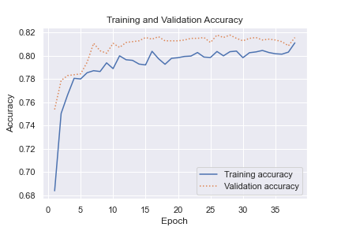

```{r setup, include=FALSE}
library(reticulate)
knitr::opts_chunk$set(echo = TRUE)
```

```{r chunk-0, include=FALSE}
source("src/rscripts/DataImport.R",local = knitr::knit_global())
source("src/rscripts/NormalizedData.R",local = knitr::knit_global())
```


\maketitle

\newpage

# Wstęp


Nasz projekt będzie dotyczył analizy danych dotyczących odchodzenia klientów firmy telekomunikacyjnej. Naszym celem jest zrozumienie, jakie czynniki wpływają na decyzję klientów o pozostaniu lub odejściu od firmy oraz jak te czynniki wpływają na skuteczność działań związanych z retencją klientów.
W ramach projektu przeprowadzamy analizę danych, w tym eksploracyjną analizę, w której badamy rozkłady zmiennych oraz korelacje między nimi. Wprowadzamy również preprocessing danych, w tym normalizację oraz kodowanie zmiennych kategorycznych. Następnie tworzymy modele predykcyjne, które pozwalają na przewidywanie odchodzenia klientów. Przetestujemy różne algorytmy klasyfikacji, dobierając ostatecznie najlepszy. W efekcie naszej analizy otrzymujemy narzędzie predykcyjne.


# Preprocessing

## Analiza opisowa

Zbiór danych Telco Customer Churn składa się z 7043 obserwacji (klientów) i 21 zmiennych. 

\begin{itemize}


\item customerID - unikalny identyfikator klienta

\item gender - płeć klienta

\item SeniorCitizen - czy klient jest emerytem (1) czy nie (0)

\item Partner - czy klient ma partnera (Tak/Nie)

\item Dependents - czy klient ma na utrzymaniu innych członków rodziny (Tak/Nie)

\item tenure - okres w miesiącach, przez który klient był klientem firmy

\item PhoneService - czy klient korzysta z usług telefonicznych (Tak/Nie)

\item MultipleLines - czy klient ma więcej niż jedną linię telefoniczną (Tak/Nie/Brak usługi)

\item InternetService - typ łącza internetowego (DSL, Fiber optic, Brak usługi)

\item OnlineSecurity - czy klient korzysta z usług zabezpieczeń internetowych (Tak/Nie/Brak usługi)

\item OnlineBackup - czy klient korzysta z usług kopii zapasowych danych online (Tak/Nie/Brak usługi)

\item DeviceProtection - czy klient korzysta z usług zabezpieczeń urządzeń (Tak/Nie/Brak usługi)

\item TechSupport - czy klient korzysta z usług technicznej pomocy (Tak/Nie/Brak usługi)

\item StreamingTV - czy klient korzysta z usług strumieniowego przesyłania telewizji (Tak/Nie/Brak usługi)

\item StreamingMovies - czy klient korzysta z usług strumieniowego przesyłania filmów (Tak/Nie/Brak usługi)

\item Contract - typ umowy (Month-to-month, One year, Two year)

\item PaperlessBilling - czy klient otrzymuje faktury w formie papierowej (Tak/Nie)

\item PaymentMethod - metoda płatności (Electronic check, Mailed check, Bank transfer (automatic), Credit 
card (automatic))

\item MonthlyCharges - miesięczny rachunek klienta

\item TotalCharges - łączny rachunek klienta

\item Churn - czy klient zrezygnował z usług firmy (Tak (1)/Nie (0)).

\end{itemize}


Wszystkie zmienne są w formie tekstowej, lub binarnej, oprócz trzech zmiennych numerycznych: SeniorCitizen, tenure, MonthlyCharges oraz jednej zmiennej numerycznej typu float: TotalCharges. Na początku dokonamy analizy tych trzech zmiennych numerycznych, wykorzystując podstawowe statystyki.


```{r chunk-1.1, fig.width=8, fig.height=6, echo=FALSE, message=FALSE, warning=FALSE, results='asis'}
source("src/rscripts/Preprocessing/ContinousVariableSummary.R", local = knitr::knit_global())
```


Badając mediany i średnie poszczególnych zmiennych z powyższej tabeli możemy wyciągnąć kilka wniosków. Na przykład średnia wartość miesięcznej opłaty to 64.76 dolara, a mediana to 70.35 dolara. Można z tego wnioskować, że rozkład tej zmiennej jest skośny w lewo, co sugeruje, że większość klientów płaci więcej niż średnia wartość. Średni czas trwania umowy wynosi 32.37 miesiąca, a mediana to 29 miesięcy. Można zauważyć, że większość klientów trzyma się firmy przez mniej niż 3 lata. Średnia wartość \textsl{MonthlyCharges} dla klientów, którzy odeszli (\textsl{Churn}=1), wynosi 74.44 dolarów, podczas gdy dla klientów, którzy pozostali (\textsl{Churn}=0), wynosi 61.27 dolarów. Można z tego wnioskować, że klienci, którzy płacą więcej za usługi, są bardziej skłonni do zrezygnowania z nich. Są to oczywiście tylko przykładowe wnioski, które możemy wyciągnąć z danych na podstawie prostych statystyk. W dalszych częściach pracy będziemy analizowali dane z pomocą modeli o różnej złożoności. 

Spójrzmy teraz na pozostałe zmienne. Na podstawie rozkładu zmiennych w poszczególnych kategoriach możemy wyciągnąć kilka wniosków (udział ten można zobaczyć na histogramach w kolejnym podrozdziale). Między innymi:
\begin{itemize}
\item Większość klientów to osoby indywidualne (0.715).

\item Większość klientów korzysta z usługi telefonii cyfrowej (0.903).

\item Większość klientów korzysta z faktury elektronicznej (0.704).

\item Większość klientów nie korzysta z usługi ochrony urządzeń (0.901).

\item Około połowa klientów korzysta z usługi internetu szerokopasmowego (0.468).

\end{itemize}
Z powyższych danych można wywnioskować, że firma powinna skupić się na promowaniu usługi internetu szerokopasmowego oraz usługi ochrony urządzeń, aby zwiększyć liczbę klientów korzystających z tych usług. Dodatkowo, firma powinna zastanowić się nad przyczynami, dla których tak mało klientów korzysta z faktury elektronicznej i ewentualnie wdrożyć działania promocyjne, zachęcające do korzystania z tej formy rozliczenia.

## Wykresy 
Zacznijmy od analizy wykresów. Na początek zmienne ciągłe. Na wykresach \ref{fig:Boxplots} i \ref{fig:Density} oraz w tabeli poniżej widzimy, że zmienne te są w znacząco różnych skalach, więc prawdopodobnie potrzebna będzie normalizacja. Zmienna \textsl{tenure}, a więc czas jaki dana osoba była/jest klientem, waha się od 1 do 72 miesięcy. Przy czym jej rozkład jest dwumodalny. Teoretycznie powinno się wydawać, że rozkład tej zmiennej powinien mieć charakter podobny do rozkładów z rodziny Gamma (np. rozkładu wykładniczego). W końcu każdy klient po pewnym czasie odchodzi, a więc w miarę upływu czasu klientów ubywa. Być może jednak jakieś procesy rynkowe spowodowały, że mamy liczniejszą grupę klientów ze stażem ok. 70 miesięcy (np. 70 miesięcy temu dana firma proponowała bardzo korzystne umowy). Kolejną zmienną jest \textsl{MonthlyCharges}. Jej estymowany rozkład jest bardzo nieregularny. Ma kilka maksimów lokalnych. Występują one w okolicach okrągłych liczb, takich jak 50 czy 80. Zapewne są związane z jakimiś limitami, które posiadają klienci, gdyż najczęściej nie przekraczają tych kolejnych dziesiątek, albo mówiąc inaczej cyfra 9 pojawia się tu nadzwyczaj często jako cyfra jedności. Na koniec zostaje jeszcze \textsl{TotalCharges}. Zmienna ta ma spodziewany rozkład, tzn. przypomina on swoim kształtem rozkład Gamma. Wartości tej zmiennej są dużo większe od pierwszych dwóch, dlatego przeprowadzimy normalizacje danych przed ich użyciem.

Na wykresie \ref{fig:Boxplots_Churn} i \ref{fig:Density_Churn} widać, że każda ze zmiennych ma istotnie różny rozkład, gdy pogrupujemy ją ze względu na Churn. Najbardziej wyróżnia się \textsl{tenure}, gdzie widać że odchodzili głównie nowi klienci. Podobnie odchodzili głównie klienci, których łączne opłaty były stosunkowo niskie, ale wynika to z korelacji zmiennej \textsl{TotalCharges} ze zmienną \textsl{tenure} (opiszemy to później). Natomiast jeśli chodzi o \textsl{MonthlyCharges}, to klienci, którzy odeszli, przeważają wśród tych co płacili większe miesięczne rachunki, co nie dziwi. 


Na wykresach \ref{fig:CategorialVariable1}, \ref{fig:CategorialVariable2}, \ref{fig:CategorialVariable3}, \ref{fig:CategorialVariable4} widzimy, że w niektórych przypadkach są duże różnice w ilości obserwacji z każdej kategorii, jeśli chodzi o daną zmienną. W szczególności takimi zmiennymi są \textsl{PhoneService}, czy \textsl{MultipleLines}. Natomiast w znacznej więszkości proporcje klientów, którzy zostali i odeszli są podobne w każdej kategorii. Wyróżniają się tu osoby, które miały miesięczne kontrakty. To głównie one rezygnowały z usług operatora. W przypadku umów długoterminowych takie sytuacje zdarzały się bardzo rzadko. Podobnie wyróżnia się sposób płatności. Prawie połowa osób płacących za pomocą \textsl{electrionic check} odeszła. Oczywiście w innych metodach płatności te liczby nie były aż tak duże. Można też zauważyć, że wśród straconych klientów jest bardzo mało osób, które nie korzystały z usług internetowych.

```{r chunk-1, fig.width=8, fig.height=6, echo=FALSE, message=FALSE, warning=FALSE, fig.cap="\\label{fig:Boxplots}Boxploty zmiennych ciągłych"}
source("src/rscripts/Preprocessing/Plots/ContinousVariable/Boxplots.R", local = knitr::knit_global())
```

```{r chunk-2, fig.width=8, fig.height=6, echo=FALSE, message=FALSE, warning=FALSE, fig.cap="\\label{fig:Boxplots_Churn}Boxploty zmiennych ciągłych z  podziałem ze względu na Churn"}
source("src/rscripts/Preprocessing/Plots/ContinousVariable/Boxplots_Churn.R", local = knitr::knit_global())
```

```{r chunk-3, fig.width=8, fig.height=6, echo=FALSE, message=FALSE, warning=FALSE, fig.cap="\\label{fig:Density}Estymator jądrowy gęstości"}
source("src/rscripts/Preprocessing/Plots/ContinousVariable/Density.R", local = knitr::knit_global())
```

```{r chunk-4, fig.width=8, fig.height=6, echo=FALSE, message=FALSE, warning=FALSE, fig.cap="\\label{fig:Density_Churn}Estymator jądrowy gęstości z podziałem ze względu na Churn"}
source("src/rscripts/Preprocessing/Plots/ContinousVariable/Density_Churn.R", local = knitr::knit_global())
```

```{r chunk-5.1, fig.width=8, fig.height=10, echo=FALSE, message=FALSE, warning=FALSE, fig.cap="\\label{fig:CategorialVariable1}Wykres ilości obserwacji z podziałem na kategorie zmiennych"}
source("src/rscripts/Preprocessing/Plots/CategoricalVariable/CategoricalVariablePlots.R", local = knitr::knit_global())
cat_cols1 <- WA_Fn_UseC_Telco_Customer_Churn %>%
  select(gender,SeniorCitizen,Partner,Dependents) %>%
  keep(is.character) %>% 
  names()
plots1 <- lapply(cat_cols1, function(col) {
  p <- ggplot(WA_Fn_UseC_Telco_Customer_Churn, aes_string(x = col, fill = WA_Fn_UseC_Telco_Customer_Churn$Churn)) +
    geom_bar() +
    theme(axis.text.x = element_text(angle = 90, vjust = 0.5, hjust=1)) +
    labs(title = col)
  # dodanie etykiet z liczbą obserwacji
  p + geom_text(stat='count', aes(label=..count..), position=position_stack(0.5))
})
grid.arrange(grobs = plots1, ncol = 2)
```

```{r chunk-5.2, fig.width=8, fig.height=10, echo=FALSE, message=FALSE, warning=FALSE, fig.cap="\\label{fig:CategorialVariable2}Wykres ilości obserwacji z podziałem na kategorie zmiennych"}
source("src/rscripts/Preprocessing/Plots/CategoricalVariable/CategoricalVariablePlots.R", local = knitr::knit_global())
cat_cols2 <- WA_Fn_UseC_Telco_Customer_Churn %>%
  select(PhoneService,MultipleLines,InternetService,OnlineSecurity) %>%
  keep(is.character) %>% 
  names()
plots2 <- lapply(cat_cols2, function(col) {
  p <- ggplot(WA_Fn_UseC_Telco_Customer_Churn, aes_string(x = col, fill = WA_Fn_UseC_Telco_Customer_Churn$Churn)) +
    geom_bar() +
    theme(axis.text.x = element_text(angle = 90, vjust = 0.5, hjust=1)) +
    labs(title = col)
  # dodanie etykiet z liczbą obserwacji
  p + geom_text(stat='count', aes(label=..count..), position=position_stack(0.5))
})
grid.arrange(grobs = plots2, ncol = 2)
```

```{r chunk-5.3, fig.width=8, fig.height=10, echo=FALSE, message=FALSE, warning=FALSE, fig.cap="\\label{fig:CategorialVariable3}Wykres ilości obserwacji z podziałem na kategorie zmiennych"}
source("src/rscripts/Preprocessing/Plots/CategoricalVariable/CategoricalVariablePlots.R", local = knitr::knit_global())
cat_cols3 <- WA_Fn_UseC_Telco_Customer_Churn %>%
  select(OnlineBackup,DeviceProtection,TechSupport,StreamingTV) %>%
  keep(is.character) %>% 
  names()
plots3 <- lapply(cat_cols3, function(col) {
  p <- ggplot(WA_Fn_UseC_Telco_Customer_Churn, aes_string(x = col, fill = WA_Fn_UseC_Telco_Customer_Churn$Churn)) +
    geom_bar() +
    theme(axis.text.x = element_text(angle = 90, vjust = 0.5, hjust=1)) +
    labs(title = col)
  # dodanie etykiet z liczbą obserwacji
  p + geom_text(stat='count', aes(label=..count..), position=position_stack(0.5))
})
grid.arrange(grobs = plots3, ncol = 2)
```

```{r chunk-5.4, fig.width=8, fig.height=10, echo=FALSE, message=FALSE, warning=FALSE, fig.cap="\\label{fig:CategorialVariable4}Wykres ilości obserwacji z podziałem na kategorie zmiennych"}
source("src/rscripts/Preprocessing/Plots/CategoricalVariable/CategoricalVariablePlots.R", local = knitr::knit_global())
cat_cols4 <- WA_Fn_UseC_Telco_Customer_Churn %>%
  select(StreamingMovies,Contract,PaperlessBilling,PaymentMethod) %>%
  keep(is.character) %>% 
  names()

plots4 <- lapply(cat_cols4, function(col) {
  p <- ggplot(WA_Fn_UseC_Telco_Customer_Churn, aes_string(x = col, fill = WA_Fn_UseC_Telco_Customer_Churn$Churn)) +
    geom_bar() +
    theme(axis.text.x = element_text(angle = 90, vjust = 0.5, hjust=1)) +
    labs(title = col)
  # dodanie etykiet z liczbą obserwacji
  p + geom_text(stat='count', aes(label=..count..), position=position_stack(0.5))
})
grid.arrange(grobs = plots4, ncol = 2)
```


\clearpage

## Interpretacja Wyników

W naszych danych jest zaledwie 11 obserwacji z brakującymi danymi (na 7033 łącznie). Zatem zasadne jest pominięcie ich w trakcie analizy danych. Nie stosujemy żadnej imputacji. Ilość danych wydaje się odpowiednia (nie za mała i nie za duża). W analizie dokonujemy losowego podziału na zbiór treningowy i testowy. 

W tabeli poniżej mamy macierz korelacji zmiennych ciągłych. Jak widać istnieje mocna korelacja pomiędzy tym jak długo klient korzysta/korzystał z usług, a kwotą jaką zapłacił za usługi. Nie powinno to dziwić. Na razie jednak nie decydujemy się na wyrzucenie którejś ze zmiennych, ponieważ zarówno czas jak i koszt może być istotny w kontekście odchodzenia klientów. Te dwie rzeczy nie muszą być ze sobą powiązane w pełni. Może być tak, że odchodzą głównie nowi klienci, niezależnie od tego ile płacą. Albo może być tak, że odchodzą klienci, którzy zapłacili rachunki powyżej pewnej sumy, niekoniecznie będący długo/krótko stażem.

```{r chunk-7, fig.width=8, fig.height=6, echo=FALSE, message=FALSE, warning=FALSE, results='asis'}
source("src/rscripts/Preprocessing/CorrelationAnalysis/ContiniousVariableCorrelation.R", local = knitr::knit_global())
```


Potrzebne będzie wykonanie transformacji danych, w szczególności normalizacji. Natomiast jeśli chodzi o obserwacje odstające, to nie ma ich za dużo. Pojawiają się licznie w przypadku zmiennej \textsl{TotalCharges} pogrupowanej ze względu na \textsl{Churn}. Widać, że jest tendencja, aby odchodzący klienci należej do jednej z dwóch grup. Są albo nowymi klientami, albo klientami z dużym stażem. Ta druga grupa jest na wykresie pudełkowym interpertowana jako obserwacje odstające. W rzeczywistości należy to interpretować tak, że rozkład tej zmiennej jest dwumodalny, nie będziemy stosować technik mających na celu ignorowanie lub zmniejszenie wpływu tych obserwacji, znacząco odbiegających od reszty.

# Klasyfikacja

## Regresja Liniowa

Zacznijmy od metod, w których bierzemy pod uwagę jedynie zmienne ciągłe. Na początek regresja liniowa. Zastosowaliśmy model regresji liniowej, który bierze pod uwagę 3 zmienne ciągłe, jako zmienne objaśniające i \textsl{Churn}, jako zmienną objaśnianą. Otrzymane w ten sposób wartości dzielimy na dwie grupy stosując punkt odcięcia na ustalonym poziomie. Na wykresie \ref{fig:LinearRegressionPlotAccuracy} widzimy skuteczność predykcji dla punktów odcięcia pomiędzy 1 i 2. Wybieramy ten z największą skutecznością i sprawdzamy jak wygląda macierz pomyłek dla niego (\ref{tab:LinearRegression}). Jak widać osiągamy w ten sposób całkiem niezłą skuteczność na poziomie 0.7978648, co jest o ok. 0.05 więcej niż, gdybyśmy estymowali każdą obserwacje do liczniejszej klasy.

Zastanówmy się jeszcze jaki wpływ miały poszczególne zmienne w modelu. W tym celu przyjrzyjmy się współczynnikom w modelu (wykres \ref{fig:LinearRegressionCoefficientPlot}). Nie ma tam stałej, ponieważ nie ma ona wpływu na model (i tak później ustalamy punkt odcięcia). Widać natomiast, że największy wpływ na to że ktoś jest sklasyfikowany z \textsl{Churn}=1, ma zmienna \textsl{MonthlyCharges}. Im większe miesięczne opłaty, tym większe prawdopodobieństwo że osoba zrezygnuje z umowy. Odwrotnie jest w przypadku łącznych opłat i stażu klienta, które to zmienne zwiększają prawdopodobieństwo aby obserwacja była zakwalifikowana jako \textsl{Churn}=0.

```{r chunk-8, fig.width=8, fig.height=6, echo=FALSE, message=FALSE, warning=FALSE, fig.cap="\\label{fig:LinearRegressionPlotAccuracy}Skuteczność predykcji dla poszczególnych punktów odcięcia"}
#source("src/rscripts/Classification/LinearRegression/LinearRegressionPlotAccuracy.R", local = knitr::knit_global())
source("src/rscripts/Classification/LinearRegression/LinearRegressionExecute.R")
source("src/rscripts/Classification/LinearRegression/LinearRegression.R")

plot_threshold_accuracy(linear_regression_model, test_data)
```

```{r chunk-9, fig.width=8, fig.height=6, echo=FALSE, message=FALSE, warning=FALSE, results='asis'}
source("src/rscripts/Classification/LinearRegression/LinearRegressionConfusionMatrix.R", local = knitr::knit_global())
```

```{r chunk-10, fig.width=8, fig.height=6, echo=FALSE, message=FALSE, warning=FALSE, fig.cap="\\label{fig:LinearRegressionCoefficientPlot}wartości współczynników w modelu regresji logistycznej"}
#source("src/rscripts/Classification/LinearRegression/LinearRegressionCoefficientPlot.R", local = knitr::knit_global())
source("src/rscripts/Classification/LinearRegression/LinearRegression.R")
source("src/rscripts/Classification/LinearRegression/LinearRegressionExecute.R")

plot_regression_coefficients(linear_regression_model)
```


## Regresja Logistyczna

Teraz model regresji logistycznej. Standardowo, wzięliśmy pod uwagę wszystkie zmienne i zbudowaliśmy model z domyślnymi parametrami. Punkt odcięcia wybraliśmy testując skuteczności przy różnych wartościach. Na wykresie \ref{fig:LogisticRegressionPlotAccuracy} widzimy, że najskuteczniejszy był model z punktem odcięcia równym 0.52. Z tabeli \ref{tab:LinearRegression} widzimy, że skuteczność wynosi niemal dokładnie 0.82. Można się jeszcze  przyjrzeć współczynnikom modelu. Na ich podstawie widzimy, że największy wpływ oprócz \textsl{MonthlyCharges} i \textsl{tenure} mają zmienne \textsl{InternetServiceFiber} i  \textsl{InternetService}. 

```{r chunk-11, fig.width=8, fig.height=6, echo=FALSE, message=FALSE, warning=FALSE, fig.cap="\\label{fig:LogisticRegressionPlotAccuracy}Skuteczność predykcji dla poszczególnych punktów odcięcia"}
#source("src/rscripts/Classification/LinearRegression/LinearRegressionPlotAccuracy.R", local = knitr::knit_global())
source("src/rscripts/Classification/LogisticRegression/LogisticRegressionExecute.R")
source("src/rscripts/Classification/LogisticRegression/LogisticRegression.R")
plot_threshold_accuracy(logistic_regression_model, test_data)
```

```{r chunk-12, fig.width=8, fig.height=6, echo=FALSE, message=FALSE, warning=FALSE, results='asis'}
source("src/rscripts/Classification/LogisticRegression/LogisticRegressionConfusionMatrix.R", local = knitr::knit_global())
```

```{r chunk-13, fig.width=8, fig.height=6, echo=FALSE, message=FALSE, warning=FALSE, fig.cap="\\label{fig:LogisticRegressionCoefficientPlot}wartości współczynników w modelu regresji logistycznej"}
#source("src/rscripts/Classification/LinearRegression/LinearRegressionCoefficientPlot.R", local = knitr::knit_global())
source("src/rscripts/Classification/LogisticRegression/LogisticRegression.R")
source("src/rscripts/Classification/LogisticRegression/LogisticRegressionExecute.R")
plot_regression_coefficients(logistic_regression_model)
```

\clearpage

## Algorytm Naiwnego Bayesa

Zastosowaliśmy również Naive Bayes Algorithm z domyślnymi parametrami (funkcja \textsl{NaiveBayes} z pakietu \textsl{klaR}). Nie dał on jednak zbyt dobrych rezultatów. W tabeli \ref{tab:NaiveBayes} widzimy, że skutecznośc tego modelu wyniosła zaledwie 0.76. Za to po raz pierwszy mamy sytuacje kiedy obiekty, które w rzeczywistości mają \textsl{Churn}=1 są cześciej błędnie klasyfikowane niż obiekty z \textsl{Churn}=0. 

```{r chunk-14, fig.width=8, fig.height=6, echo=FALSE, message=FALSE, warning=FALSE, results='asis'}
#source("src/rscripts/Classification/LinearRegression/LinearRegressionCoefficientPlot.R", local = knitr::knit_global())
source("src/rscripts/Classification/NaiveBayes/NaiveBayesConfusionMatrix.R", local = knitr::knit_global())
```

## Algorytm k sąsiadów

W tym przypadku użyliśmy funkcji \textsl{knn} z pakietu \textsl{class}. Przeprowadziliśmy symulacje dla wszystkich wartości k od 1 do 100. Najlepszy model powstał dla k równego 48 (wykres \ref{fig:kNNPlotAccuracy}). Jego skuteczność wyniosła 0.806. 

```{r chunk-15, fig.width=8, fig.height=6, echo=FALSE, message=FALSE, warning=FALSE, fig.cap="\\label{fig:kNNPlotAccuracy}Skuteczność predykcji dla poszczególnych wartości k"}
#source("src/rscripts/Classification/LinearRegression/LinearRegressionPlotAccuracy.R", local = knitr::knit_global())
source("src/rscripts/Classification/kNN/kNN.R")
source("src/rscripts/Classification/kNN/kNNExecute.R")

plot_knn_accuracy_and_confusion_matrix(train_data_num,test_data_num)$plot
```

```{r chunk-16, fig.width=8, fig.height=6, echo=FALSE, message=FALSE, warning=FALSE, results='asis'}
#source("src/rscripts/Classification/LinearRegression/LinearRegressionCoefficientPlot.R", local = knitr::knit_global())
source("src/rscripts/Classification/kNN/kNNConfusionMatrix.R", local = knitr::knit_global())
```

\clearpage

## Drzewo decyzyjne

Użyliśmy funkcji \textsl{rpart} z pakietu \textsl{rpart}. Na wykresie poniżej widzimy jakie zmienne warunkowały kolejne przejścia w drzewie. Natomiast macierz pomyłek \ref{tab:DecisionTree} wskazuje, że skuteczność wyniosła 0.79. Oczywiście pojedyncze drzewo jest bardzo niestabilne, dlatego zastosujemy też metody ze wzmocnieniem.

```{r chunk-17, fig.width=8, fig.height=6, echo=FALSE, message=FALSE, warning=FALSE, fig.cap="\\label{fig:DecisionTree}Drzewo dezycyjne", results='hide'}
#source("src/rscripts/Classification/LinearRegression/LinearRegressionPlotAccuracy.R", local = knitr::knit_global())
#source("src/rscripts/Classification/DecisionTree/DecisionTreeExecute.R")

#print(decision_boundary)
```

```{r chunk-18, fig.width=8, fig.height=6, echo=FALSE, message=FALSE, warning=FALSE, results='asis'}
#source("src/rscripts/Classification/LinearRegression/LinearRegressionCoefficientPlot.R", local = knitr::knit_global())
source("src/rscripts/Classification/DecisionTree/DecisionTreeConfusionMatrix.R")
```

## SVM

Algorytm SVM zastosowaliśmy z 4 rodzajami jąder: liniowym, wielomianowym (stopień 3), radialnym i sigmoidalnym. W tabelach \ref{tab:SVMlinear} - \ref{tab:SVMsigmoid} widzimy wyniki. Jak widać największą skuteczność otrzymujemy stosując jądro radialne i jest ona na poziomie 0.806. Równie dobrze algorytm działa w przypadku jądra liniowego, gdzie skuteczność wynosi 0.804. W pozostałych przypadkach wyniki są dużo gorsze. 

```{r chunk-19, fig.width=8, fig.height=6, echo=FALSE, message=FALSE, warning=FALSE, results='asis'}
source("src/rscripts/Classification/SVM/SVMConfusionMatrix.R", local = knitr::knit_global())
```

```{r chunk-20, fig.width=8, fig.height=6, echo=FALSE, message=FALSE, warning=FALSE, results='asis'}
source("src/rscripts/Classification/SVM/SVMpolynomialConfusionMatrix.R", local = knitr::knit_global())
```

```{r chunk-21, fig.width=8, fig.height=6, echo=FALSE, message=FALSE, warning=FALSE, results='asis'}
source("src/rscripts/Classification/SVM/SVMradialConfusionMatrix.R", local = knitr::knit_global())
```

```{r chunk-22, fig.width=8, fig.height=6, echo=FALSE, message=FALSE, warning=FALSE, results='asis'}
source("src/rscripts/Classification/SVM/SVMsigmoidConfusionMatrix.R", local = knitr::knit_global())
```


\clearpage


Następnie zastosujemy 3 algorytmy wzmacniające. Będą to lasy losowe (Random forest), bagging i boosting. Dla tego pierwszego sprawdzimy również, jak na dokładność działania algorytmu wpłynie ilość drzew.

## Random Forest

Zacznijmy od algorytmu Random Forest. Skorzystamy z funkcji randomForest z biblioteki o tej samej nazwie. Na wykresie widzimy, że najlepsza dokładność predykcji wychodzi dla 23 drzew i wynosi ona nieco ponad $0.8$. Przedstawiamy wyniki tylko dla $n_trees \le 50$, bo dla większej ilości drzew różnica w dokładności jest już znikoma, a znacznie wzrasta złożoność obliczeniowa. Na podstawie tabeli pomyłek widzimy, że nasz model ma tendencję do lepszego klasyfikowania obserwacji negatywnych (0) niż pozytywnych (1). 


```{r chunk-23, fig.width=8, fig.height=6, echo=FALSE, message=FALSE, warning=FALSE, results='asis'}
set.seed(1213123)
source("src/rscripts/Classification/RandomForest/RandomForestExecute.R", local = knitr::knit_global())

ggplot(data = results, aes(x = ntrees, y = accuracy)) +
  geom_line() +
  geom_vline(xintercept = results$ntrees[which.max(results$accuracy)], color = "black", linetype = "dashed") +
  geom_point(aes(x = results$ntrees[which.max(results$accuracy)], y = max(results$accuracy)), color = "red", size = 3) +
  ggtitle("Zależność między dokładnością predykcji a ilością drzew w Random Forest") +
  xlab("Ilość drzew") +
  ylab("Dokładność predykcji") +
  annotate("text", x = results$ntrees[which.max(results$accuracy)], y = max(results$accuracy), label = paste0("max accuracy: ", round(max(results$accuracy), 3)), vjust = -1)

print(xtable(a,caption = "Macierz pomyłek dla lasu losowego"),comment=F)


```

## Boosting

Teraz przejdziemy do metody Boosting. Skorzystamy z bibliotek xgboost i pROC. Dostaliśmy dokładność na poziomie około $0.8$, a z macierzy pomyłek możemy odczytać, że ten model ponownie lepiej poradził sobie z klasyfikacją obserwacji negatywnych, niż pozytywnych. Skuteczność wyniosła 0.802847.

```{r chunk-24, fig.width=8, fig.height=6, echo=FALSE, message=FALSE, warning=FALSE, results='asis'}
source("src/rscripts/Classification/Boosting/Boosting.R", local = knitr::knit_global())
```


## Bagging

Ostatnim algorytmem, który zastosujemy, będzie algorytm Bagging. W celu kompilacji modelu skorzystamy z biblioteki \textsl{ipred}. Dokładność tego modelu wyszła około $0.79$, czyli nieznacznie mniej, niż w przypadku dwóch poprzednich modeli. Mamy ponownie sytuację, w której model lepiej klasyfikuje klientów, którzy zostali w firmie, niż tych, którzy odeszli.

```{r chunk-25, fig.width=8, fig.height=6, echo=FALSE, message=FALSE, warning=FALSE, results='asis'}
source("src/rscripts/Classification/Bagging/Bagging.R", local = knitr::knit_global())
```

# Podsumowanie

Spośród wszystkich algorytmów, najlepsza okazała sie regresja logistyczna. W tabeli \ref{tab:Accuracy} można zobaczyć jak wygląda skuteczność poszczególnych algorytmów. 

```{r chunk-26, fig.width=8, fig.height=6, echo=FALSE, message=FALSE, warning=FALSE, results='asis'}

accuracies <- data.frame(
  Algotrytmy = c("Reg. Lin", "Reg. Log", "Naive Bayes", "k-NN", "Decision Tree", "SVM", "Random Forest", "Bagging", "Boosting"),
  Skuteczność = c(0.7979, 0.82, 0.7552, 0.8057, 0.7871, 0.8043, 0.7865, 0.8028, 0.7894)
)

table <- xtable(accuracies, caption = "Skuteczność predykcji", label = "tab:Accuracy")

print(table, comment = F)
```

Ale skuteczność to nie jedyna istotna statytstyka. Weźmy jeszcze pod uwagę, że firmie prawdopodbnie zależało, aby jak najskuteczniej sklasyfikować osoby, które zrezygnowały z umowy, po to aby móc zaproponować klientom o podobnej charakterystyce lepsze oferty. Zatem sprawdźmy skuteczność wśród obserwacji dla któych \textsl{Churn} = 1.

```{r chunk-27, fig.width=8, fig.height=6, echo=FALSE, message=FALSE, warning=FALSE, results='asis'}

accuracies <- data.frame(
  Algotrytmy = c("Reg. Lin", "Reg. Log", "Naive Bayes", "k-NN", "Decision Tree", "SVM", "Random Forest", "Bagging", "Boosting"),
  Skuteczność = c(0.4101, 0.563, 0.7587, 0.5764, 0.4611, 0.496, 0.5201, 0.1977, 0.4450)
)

table <- xtable(accuracies, caption = "Skuteczność predykcji")

print(table, comment = F)
```

Teraz widać, że znacząco zmienia to postać rzeczy. Najlepszy w tym aspekcie okazuje się algorytm Naiwnego Bayesa. Oczywiście nie jest tak, że ta statystyka jest lepsza niż skuteczność, bo mały błąd tutaj oznacza, że w obserwacjach należących do drugiej klasy musiał być istotny błąd. Tutaj należało by zapytać firme co jest dla nich ważniejsze i w jakim stopniu.

Na koniec dodajmy jeszcze, że można się zastanowić nad ulepszeniem algorytmów. Dla przykładu zbudowaliśmy model, w którym najpierw podzieliliśmy zbiór na dwa podzbiory. W jednym z nich \textsl{Contract} był typu \textsl{Month-to-month}, drugi był jego dopełnieniem. Na obydwu podzbiorach zastosowaliśmy regresje logistyczną. Okazuje się, że skuteczność wzrosła do poziomu 0.8256 (względem 0.82). 

Przeprowadziliśmy też eksperymenty z sieciami neuronowymi z użyciem biblioteki Keras w Pythonie. W oparciu o architekturę 4 warstw (512, 256, 64, 1), zastosowaniem Dropoutu na poziomie 0.5 i krzyżowej entropii jako funkcji kosztu, sieć taka potrafiła dać skuteczność w granicach 0.81 - 0.82. Jednak po ok. 30 epokach następowało silne przeuczenie. W celu jego uniknięcia zastosowaliśmy EarlyStopping. Poniżej fragment kodu źródłowego, w któym definiujemy model (cały kod źródłowy jest ukryty w pliku .rmd ze względu na obszerność). Natomiast na wykresie \ref{fig:NeuralNetwork} widzimy, jaką skuteczność miały modele zbudowane przez sieci neuronowe po każdej epoce dla naszego modelu. Ostatecznie udało się uzyskać skuteczność na poziomie 0.8156. 

```{python chunk-28, echo=TRUE, eval=FALSE}
model = Sequential() 
model.add(Dense(512, activation='relu', input_dim=19))
model.add(Dropout(.5))
model.add(Dense(256, activation='relu'))
model.add(Dropout(.5))
model.add(Dense(32, activation='relu'))
model.add(Dropout(.5))
model.add(Dense(1, activation='sigmoid')) 
model.compile(loss='binary_crossentropy', 
              optimizer='adam', 
              metrics=['accuracy']) 

early_stopping = EarlyStopping(monitor='val_loss', 
                               patience=10, 
                               verbose=1)
reduce_lr = ReduceLROnPlateau(monitor='val_loss', 
                              factor=0.2, 
                              patience=5, 
                              min_lr=0.001)

hist = model.fit(x_train, y_train, validation_data=(x_test, y_test), 
epochs=50, batch_size=1000, verbose=0, 
callbacks=[early_stopping, reduce_lr])
```


```{python chunk-29,eval = FALSE, fig.width=8, fig.height=6, echo=FALSE, message=FALSE, warning=FALSE, results='asis', fig.cap="\\label{fig:NeuralNetwork}Skuteczność predykcji dla poszczególnych epok"}
import pandas as pd
from keras.models import Sequential
from keras.layers import Dense, Dropout
import numpy as np
import matplotlib.pyplot as plt
import seaborn as sns

train_df = pd.read_csv("train_data.csv", delimiter = None)
test_df = pd.read_csv("test_data.csv", delimiter = None)

train_df['SeniorCitizen'] = train_df['SeniorCitizen'].map({'Yes': 1, 'No': 0})
train_df['Partner'] = train_df['Partner'].map({'Yes': 1, 'No': 0})
train_df['PhoneService'] = train_df['PhoneService'].map({'Yes': 1, 'No': 0})
train_df['PaperlessBilling'] = train_df['PaperlessBilling'].map({'Yes': 1, 'No': 0})
train_df['gender'] = train_df['gender'].map({'Male': 1, 'Female': 0})
train_df['Dependents'] = train_df['Dependents'].map({'Yes': 1, 'No': 0})
train_df['MultipleLines'] = train_df['MultipleLines'].map({'Yes': 1, 'No': 0, "No phone service": 2})
train_df['OnlineSecurity'] = train_df['OnlineSecurity'].map({'Yes': 1, 'No': 0, "No internet service": 2})
train_df['OnlineBackup'] = train_df['OnlineBackup'].map({'Yes': 1, 'No': 0, "No internet service": 2})
train_df['DeviceProtection'] = train_df['DeviceProtection'].map({'Yes': 1, 'No': 0, "No internet service": 2})
train_df['TechSupport'] = train_df['TechSupport'].map({'Yes': 1, 'No': 0, "No internet service": 2})
train_df['StreamingTV'] = train_df['StreamingTV'].map({'Yes': 1, 'No': 0, "No internet service": 2})
train_df['StreamingMovies'] = train_df['StreamingMovies'].map({'Yes': 1, 'No': 0, "No internet service": 2})
train_df['InternetService'] = train_df['InternetService'].map({'DSL': 1, 'No': 0, "Fiber optic": 2})
train_df['Contract'] = train_df['Contract'].map({'One year': 1, 'Month-to-month': 0, "Two year": 2})
train_df['PaymentMethod'] = train_df['PaymentMethod'].map({'Electronic check': 1, 'Mailed check': 0, "Bank transfer (automatic)": 2, "Credit card (automatic)": 3})

test_df['SeniorCitizen'] = test_df['SeniorCitizen'].map({'Yes': 1, 'No': 0})
test_df['Partner'] = test_df['Partner'].map({'Yes': 1, 'No': 0})
test_df['PhoneService'] = test_df['PhoneService'].map({'Yes': 1, 'No': 0})
test_df['PaperlessBilling'] = test_df['PaperlessBilling'].map({'Yes': 1, 'No': 0})
test_df['gender'] = test_df['gender'].map({'Male': 1, 'Female': 0})
test_df['Dependents'] = test_df['Dependents'].map({'Yes': 1, 'No': 0})
test_df['MultipleLines'] = test_df['MultipleLines'].map({'Yes': 1, 'No': 0, "No phone service": 2})
test_df['OnlineSecurity'] = test_df['OnlineSecurity'].map({'Yes': 1, 'No': 0, "No internet service": 2})
test_df['OnlineBackup'] = test_df['OnlineBackup'].map({'Yes': 1, 'No': 0, "No internet service": 2})
test_df['DeviceProtection'] = test_df['DeviceProtection'].map({'Yes': 1, 'No': 0, "No internet service": 2})
test_df['TechSupport'] = test_df['TechSupport'].map({'Yes': 1, 'No': 0, "No internet service": 2})
test_df['StreamingTV'] = test_df['StreamingTV'].map({'Yes': 1, 'No': 0, "No internet service": 2})
test_df['StreamingMovies'] = test_df['StreamingMovies'].map({'Yes': 1, 'No': 0, "No internet service": 2})
test_df['InternetService'] = test_df['InternetService'].map({'DSL': 1, 'No': 0, "Fiber optic": 2})
test_df['Contract'] = test_df['Contract'].map({'One year': 1, 'Month-to-month': 0, "Two year": 2})
test_df['PaymentMethod'] = test_df['PaymentMethod'].map({'Electronic check': 1, 'Mailed check': 0, "Bank transfer (automatic)": 2, "Credit card (automatic)": 3})

x_train = train_df.drop(['Churn'], axis=1)
y_train = train_df['Churn']

x_test = test_df.drop(['Churn'], axis=1)
y_test = test_df['Churn']

model = Sequential() 
model.add(Dense(512, activation='relu', input_dim=19))
model.add(Dropout(.5))
model.add(Dense(256, activation='relu'))
model.add(Dropout(.5))
model.add(Dense(32, activation='relu'))
model.add(Dropout(.5))
model.add(Dense(1, activation='sigmoid')) 
model.compile(loss='binary_crossentropy', optimizer='adam', metrics=['accuracy']) 

early_stopping = EarlyStopping(monitor='val_loss', patience=10, verbose=1)
reduce_lr = ReduceLROnPlateau(monitor='val_loss', factor=0.2, patience=5, min_lr=0.001)

hist = model.fit(x_train, y_train, validation_data=(x_test, y_test), epochs=50, batch_size=1000, verbose=0, callbacks=[early_stopping, reduce_lr])
sns.set()
 
acc = hist.history['accuracy']
val = hist.history['val_accuracy']
epochs = range(1, len(acc) + 1)
 
plt.plot(epochs, acc, '-', label='Training accuracy')
plt.plot(epochs, val, ':', label='Validation accuracy')
plt.title('Training and Validation Accuracy')
plt.xlabel('Epoch')
plt.ylabel('Accuracy')
plt.legend(loc='lower right')
plt.plot()
plt.show()

```

```{r chunk-30, eval=TRUE, fig.width=8, fig.height=6, echo=FALSE, message=FALSE, warning=FALSE, fig.cap="\\label{fig:NeuralNetwork}Skuteczność sieci neuronowej po każdej epoce"}

```
